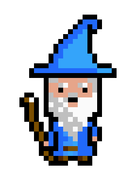

{width=25%}

 

This website is a collection of renal resources, clinical documents and snippets of information that I find personally useful.

This will include protocols, educational materials and practice pearls as well as printable resources to provide to patients. Its envisioned that much of this documentation will be assembled from around the internet and will be attributed and linked where relevant. Future plans include an educational component or this may instead become a different website.

***
&nbsp;

By <a href="https:eoindosullivan.com">Eoin O'Sullivan</a>

<em>eoindosullivan@gmail.com</em>

<!-- this is not working correctly, need to call font awesome properly -->

    
    
    
    
    

&nbsp;
