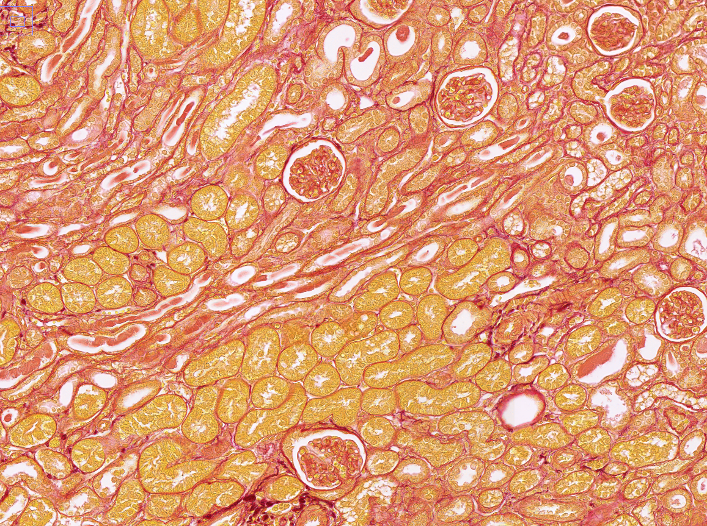

**Welcome to Nephstuff (clearly a work in progress title)**

{width=50%}

# Notes

This website is a collection of  renal resources and clinical documents. Its primarily a collection of cheat sheets and useful documents for my own practice, but I thought it might be useful to the community to share.

This will include protocols, educational materials and practice pearls as well as printable resourses to provide to patients. Its envisioned that much of this documentation will be assembled from around the internet and will be attributed and linked where relevant. Future plans include an educational component or this may instead become a different website.

